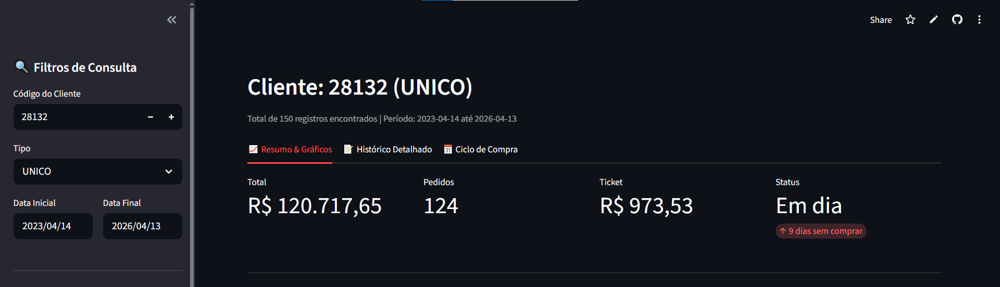
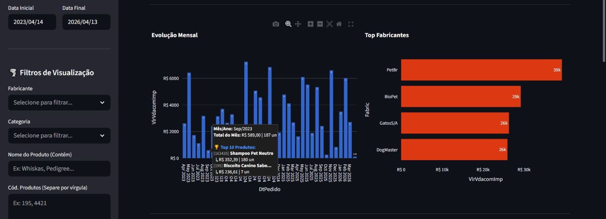
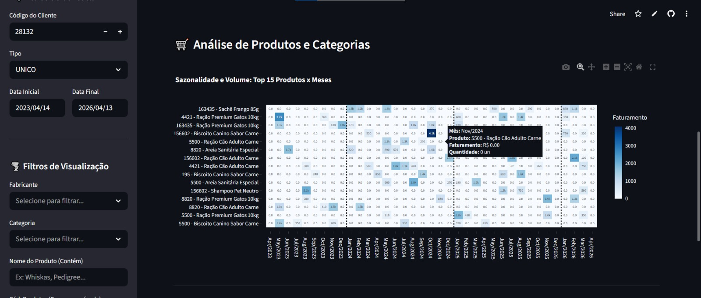
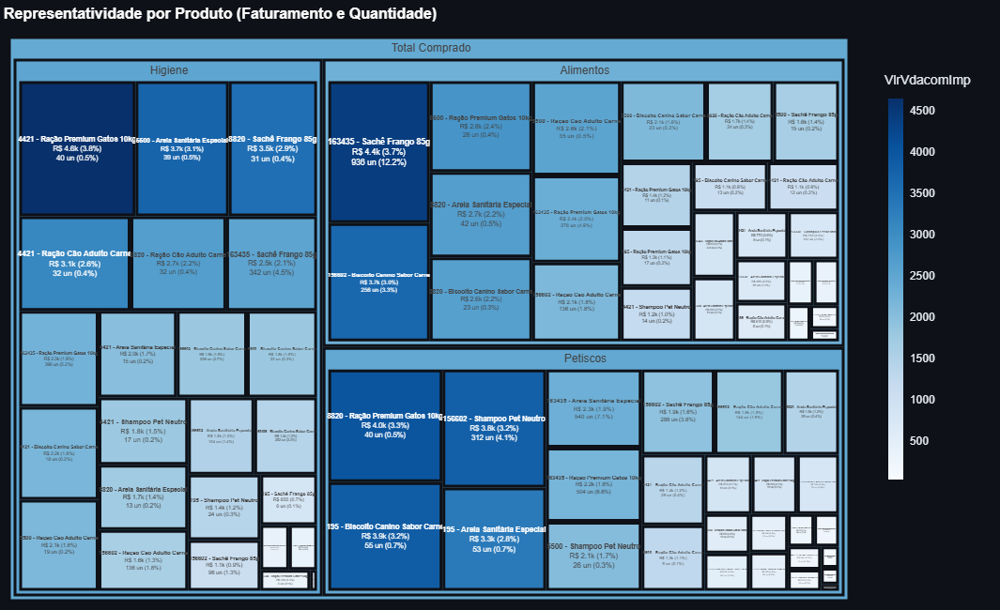
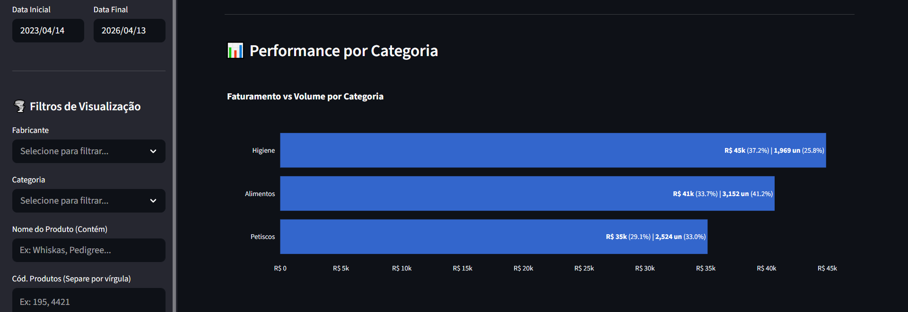
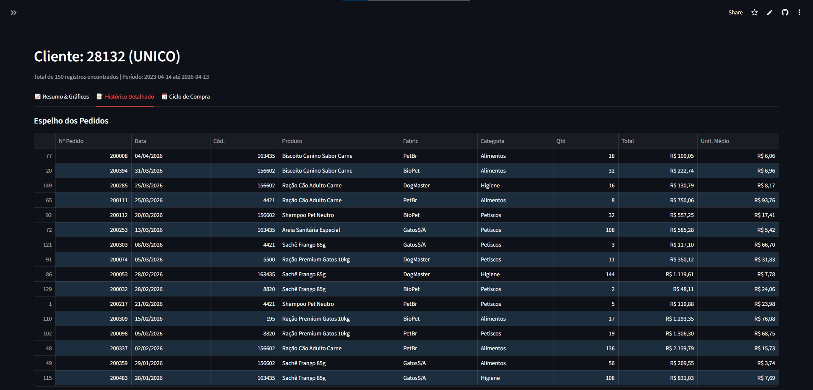
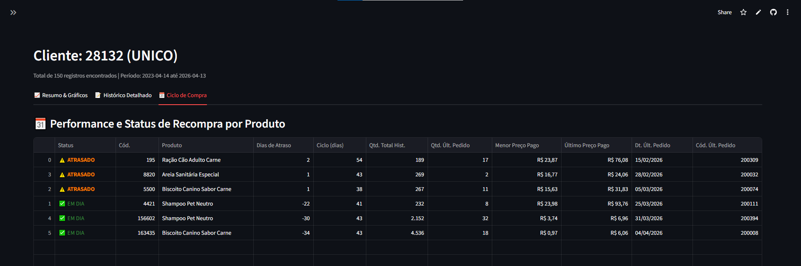

# 📊 B2B Sales & Repurchase Analytics Dashboard

**🔴 [CLIQUE AQUI PARA ACESSAR O DASHBOARD AO VIVO](https://b2b-sales-analytics-dashboard-w2cppsyg7qn4pwhe98n4hw.streamlit.app/)**

*(Nota de Segurança: Para fins de demonstração pública e compliance corporativo, a versão online está conectada a um gerador em tempo real de **Mock Data** [Dados Sintéticos]. A estrutura, os cálculos e a interface são idênticos aos de produção, mas os valores financeiros e nomes de produtos são fictícios para preservar o sigilo das informações reais da empresa).*

---

## 🎯 Sobre o Projeto

No mercado de distribuição B2B, entender a jornada de consumo do cliente e antecipar a necessidade de reposição de estoque é o maior diferencial competitivo de uma equipe comercial. Este projeto foi desenvolvido para atuar como uma ponte direta entre o banco de dados relacional da empresa (SQL Server) e a ponta de vendas.

Através de uma interface web interativa construída em Streamlit, o dashboard processa o histórico de faturamento e traduz dados brutos em insights visuais rápidos. O maior valor agregado da ferramenta é o seu **Motor de Análise de Ciclo de Compra**, que mapeia o comportamento de recompra do cliente produto a produto, gerando alertas automáticos contra *churn* (evasão).

## 📸 Galeria de Telas e Funcionalidades

### 1. Visão Geral e KPIs Consolidados
Visão imediata da saúde do cliente no período selecionado, com total faturado, quantidade de pedidos, ticket médio e o status geral de frequência de compra.


### 2. Análise Temporal e Curva ABC de Fornecedores
Evolução mensal detalhada (com tooltips interativos mostrando os top 10 produtos de cada mês) e o ranking de fabricantes.


### 3. Matriz de Sazonalidade (Heatmap)
Um mapa de calor que cruza os 15 produtos mais vendidos com a linha do tempo, permitindo identificar padrões de consumo sazonais rapidamente.


### 4. Árvore de Representatividade (Treemap)
Detalhamento de faturamento e volume físico distribuído hierarquicamente por Categoria > Fabricante > Produto.


### 5. Performance de Faturamento vs Volume
Análise comparativa detalhando a representatividade financeira e quantitativa de cada categoria de produtos.


### 6. Auditoria de Pedidos (Espelho)
Tabela detalhada com a listagem cronológica de cada nota/pedido emitido, calculando dinamicamente o preço unitário médio de cada operação.


### 7. Prevenção de Churn (Ciclo de Recompra)
O coração analítico da ferramenta. Calcula há quantos dias o cliente não compra um SKU específico, compara com o ciclo médio histórico e gera alertas de urgência, além de trazer o "Último Preço Pago" como ferramenta de negociação.


---

## 🛠️ Tecnologias e Arquitetura

* **Linguagem:** Python 3
* **Ambiente de Desenvolvimento:** Anaconda
* **Interface e Web App:** Streamlit
* **Engenharia de Dados:** Pandas & Numpy
* **Visualização Avançada:** Plotly Express
* **Conexão com Banco de Dados:** SQL Server via `pyodbc` (com tratamento de compatibilidade para Drivers 13, 17 e 18).
* **Gerenciamento de Credenciais:** `python-dotenv`

## 🚀 Como executar este projeto localmente (Modo Produção)

Para conectar o dashboard ao banco de dados real, siga os passos abaixo:

### 1. Clone o repositório
```bash
git clone [https://github.com/SEU_USUARIO/b2b-sales-analytics-dashboard.git](https://github.com/SEU_USUARIO/b2b-sales-analytics-dashboard.git)
cd b2b-sales-analytics-dashboard
```

### 2. Instale as dependências
Ative seu ambiente Anaconda e instale os pacotes:
```bash
pip install -r requirements.txt
```

### 3. Configure as Variáveis de Ambiente
Crie um arquivo chamado `.env` na raiz do projeto. Use o arquivo `.env.example` como base e insira as credenciais de acesso ao SQL Server:
```env
DB_SERVER=endereco_do_servidor
DB_DATABASE=nome_do_banco
DB_UID=usuario
DB_PWD=senha
```
*Certifique-se de que o arquivo `.env` não seja commitado (ele já deve estar no seu `.gitignore`).*

### 4. Execute a aplicação
```bash
streamlit run app.py
```

## 🧠 Algoritmo de Regras de Negócio

1. **Tratamento de Displays:** O sistema possui uma lógica embutida para converter produtos vendidos em caixas/displays para unidades reais de consumo, garantindo que o ticket unitário reflita a realidade de prateleira.
2. **Cálculo de Recompra:** A aplicação agrupa o histórico por código de produto, extrai o *delta* em dias entre cada pedido consecutivo e calcula a média de tempo (Ciclo).
3. **Trigger de Alerta:** Subtrai-se a data do último pedido da data atual. Se esse valor ultrapassar o Ciclo calculado, o painel muda o status do item de "✅ EM DIA" para "⚠️ ATRASADO" ou "🚨 URGENTE", armando a equipe com a informação exata (e o último preço praticado) para acionar o cliente proativamente.

---
*Desenvolvido com foco na resolução de problemas reais de negócios através de Engenharia de Dados e Visualização Estratégica.*
